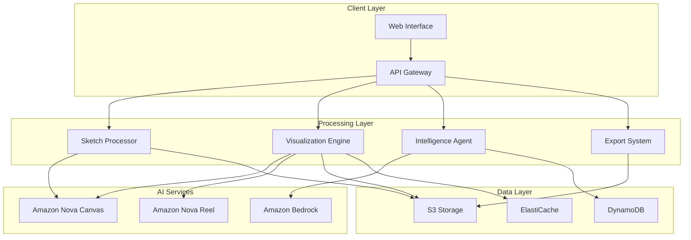

# Design Document: DraftBridge

## Overview

DraftBridge is an AI-powered architectural co-pilot that transforms hand-drawn sketches into professional 3D visualizations and CAD/BIM files. The system employs a microservices architecture built on AWS, leveraging Amazon Nova for image generation, Amazon Bedrock for intelligent analysis, and specialized processing pipelines for sketch interpretation and professional file export.

The architecture follows a modular design with clear separation of concerns, enabling scalability, maintainability, and integration with existing architectural workflows. The system processes user sketches through multiple stages: analysis, 3D visualization, compliance checking, and professional file generation.

## Architecture

### High-Level Architecture



### Service Architecture

The system is composed of four core microservices:

1. **Sketch Processor Service**: Analyzes uploaded sketches and extracts architectural elements
2. **Visualization Engine Service**: Generates 3D renders and walkthrough videos
3. **Intelligence Agent Service**: Provides architectural analysis and code compliance checking
4. **Export System Service**: Converts designs to professional CAD/BIM formats

Each service is containerized and deployed on AWS ECS with auto-scaling capabilities. Services communicate through REST APIs and asynchronous message queues (SQS) for long-running operations.

### Data Flow

1. User uploads sketch → Sketch Processor analyzes and stores structured data
2. Structured data → Visualization Engine generates 3D renders using Nova Canvas
3. 3D model → Intelligence Agent performs compliance analysis using Bedrock
4. Approved design → Export System generates CAD/BIM files
5. All artifacts stored in S3 with metadata in DynamoDB

## Components and Interfaces

### Sketch Processor Service

**Purpose**: Analyzes hand-drawn sketches to extract architectural elements and spatial relationships.

**Key Components**:
- Image preprocessing pipeline for sketch enhancement
- Computer vision models for element detection
- Natural language processing for label interpretation
- Spatial relationship analyzer

**Interfaces**:
```typescript
interface SketchProcessor {
  analyzeSketch(imageData: Buffer, metadata: SketchMetadata): Promise<SketchAnalysis>
  extractElements(analysis: SketchAnalysis): Promise<ArchitecturalElement[]>
  interpretLabels(elements: ArchitecturalElement[]): Promise<LabeledElement[]>
  validateSpatialRelationships(elements: LabeledElement[]): Promise<ValidationResult>
}

interface SketchAnalysis {
  id: string
  elements: DetectedElement[]
  spatialRelationships: SpatialRelation[]
  confidence: number
  suggestedImprovements: string[]
}
```

**Integration**: Uses Amazon Bedrock for advanced image analysis and Amazon Textract for text extraction from sketches.

### Visualization Engine Service

**Purpose**: Generates photorealistic 3D renders and walkthrough videos from processed sketch data.

**Key Components**:
- Nova Canvas integration for image generation
- Nova Reel integration for video generation
- Prompt engineering pipeline for optimal results
- Material and lighting suggestion engine
- Iterative refinement system

**Interfaces**:
```typescript
interface VisualizationEngine {
  generateRender(elements: LabeledElement[], preferences: RenderPreferences): Promise<Render>
  createWalkthrough(render: Render, path: WalkthroughPath): Promise<Video>
  applyLightingSimulation(render: Render, timeOfDay: TimeSettings): Promise<Render>
  suggestImprovements(render: Render): Promise<Suggestion[]>
  refineDesign(render: Render, modifications: Modification[]): Promise<Render>
}

interface Render {
  id: string
  imageUrl: string
  resolution: Resolution
  elements: RenderElement[]
  lighting: LightingSettings
  materials: MaterialSettings
  metadata: RenderMetadata
}
```

**Integration**: Primary integration with Amazon Nova Canvas for image generation and Nova Reel for video creation. Uses S3 for asset storage and CloudFront for content delivery.

### Intelligence Agent Service

**Purpose**: Provides architectural analysis, code compliance checking, and design recommendations.

**Key Components**:
- Building code compliance engine
- ADA accessibility validator
- Energy efficiency analyzer
- Spatial regulation checker
- RAG system with building standards database

**Interfaces**:
```typescript
interface IntelligenceAgent {
  checkCompliance(design: Design, codes: BuildingCode[]): Promise<ComplianceReport>
  validateAccessibility(design: Design): Promise<AccessibilityReport>
  analyzeEnergyEfficiency(design: Design): Promise<EnergyReport>
  suggestImprovements(design: Design, issues: Issue[]): Promise<Recommendation[]>
  validateSpatialRequirements(design: Design): Promise<SpatialValidation>
}

interface ComplianceReport {
  id: string
  overallCompliance: boolean
  violations: Violation[]
  recommendations: Recommendation[]
  score: number
  checkedCodes: BuildingCode[]
}
```

**Integration**: Uses Amazon Bedrock with RAG capabilities, accessing a knowledge base of building codes, ADA standards, and architectural best practices stored in Amazon OpenSearch.

### Export System Service

**Purpose**: Converts designs to industry-standard CAD/BIM file formats.

**Key Components**:
- CAD file generator (DWG, DXF formats)
- BIM file generator (RVT, IFC formats)
- Python script generator for automation
- Metadata preservation system
- Quality validation pipeline

**Interfaces**:
```typescript
interface ExportSystem {
  exportToCAD(design: Design, format: CADFormat): Promise<CADFile>
  exportToBIM(design: Design, format: BIMFormat): Promise<BIMFile>
  generatePythonScript(design: Design, targetSoftware: Software): Promise<PythonScript>
  validateExport(file: ExportedFile): Promise<ValidationResult>
  preserveMetadata(design: Design, file: ExportedFile): Promise<EnrichedFile>
}

interface CADFile {
  id: string
  format: CADFormat
  fileUrl: string
  elements: CADElement[]
  layers: Layer[]
  metadata: FileMetadata
}
```

**Integration**: Uses specialized libraries for CAD/BIM file generation and integrates with S3 for file storage. Implements IFC standards for interoperability.

## Data Models

### Core Domain Models

```typescript
// Sketch and Analysis Models
interface Sketch {
  id: string
  userId: string
  imageUrl: string
  uploadedAt: Date
  analysis?: SketchAnalysis
  status: ProcessingStatus
}

interface ArchitecturalElement {
  id: string
  type: ElementType // WALL, DOOR, WINDOW, ROOM, etc.
  coordinates: Point[]
  dimensions: Dimensions
  properties: ElementProperties
  labels: string[]
  confidence: number
}

// Design and Visualization Models
interface Design {
  id: string
  sketchId: string
  userId: string
  elements: DesignElement[]
  renders: Render[]
  walkthroughs: Video[]
  complianceReports: ComplianceReport[]
  version: number
  createdAt: Date
  updatedAt: Date
}

interface DesignElement {
  id: string
  sourceElement: ArchitecturalElement
  visualProperties: VisualProperties
  spatialProperties: SpatialProperties
  materialProperties: MaterialProperties
}

// Compliance and Analysis Models
interface Violation {
  id: string
  code: string
  severity: ViolationSeverity
  description: string
  location: ElementReference
  recommendation: string
  autoFixable: boolean
}

interface BuildingCode {
  id: string
  name: string
  jurisdiction: string
  version: string
  rules: CodeRule[]
  applicableElementTypes: ElementType[]
}

// Export Models
interface ExportedFile {
  id: string
  designId: string
  format: FileFormat
  fileUrl: string
  elements: ExportElement[]
  metadata: ExportMetadata
  generatedAt: Date
}
```

### Database Schema

**DynamoDB Tables**:

1. **Sketches Table** (Primary Key: sketchId)
   - Stores sketch metadata and analysis results
   - GSI on userId for user queries

2. **Designs Table** (Primary Key: designId)
   - Stores design data and version history
   - GSI on userId and sketchId for queries

3. **ComplianceReports Table** (Primary Key: reportId)
   - Stores compliance analysis results
   - GSI on designId for design-specific queries

4. **ExportedFiles Table** (Primary Key: fileId)
   - Stores export metadata and file references
   - GSI on designId for design-specific exports

**S3 Bucket Structure**:
```
draftbridge-assets/
├── sketches/
│   ├── original/
│   └── processed/
├── renders/
│   ├── images/
│   └── videos/
├── exports/
│   ├── cad/
│   ├── bim/
│   └── scripts/
└── cache/
    ├── thumbnails/
    └── previews/
```

Now I need to use the prework tool to analyze the acceptance criteria before writing the Correctness Properties section:

<function_calls>
<invoke name="prework">
<parameter name="featureName">draftbridge

## Correctness Properties

*A property is a characteristic or behavior that should hold true across all valid executions of a system—essentially, a formal statement about what the system should do. Properties serve as the bridge between human-readable specifications and machine-verifiable correctness guarantees.*

Based on the prework analysis, the following properties have been identified to validate the system's correctness across all acceptance criteria:

### Sketch Processing Properties

**Property 1: Element Detection Completeness**
*For any* hand-drawn sketch containing architectural elements, the Sketch_Processor should identify all recognizable elements with confidence scores above the minimum threshold
**Validates: Requirements 1.1**

**Property 2: Label Recognition Accuracy**
*For any* sketch with text labels and annotations, the Sketch_Processor should correctly interpret the labels and associate them with the appropriate architectural elements
**Validates: Requirements 1.2**

**Property 3: Spatial Relationship Preservation**
*For any* processed sketch, the spatial relationships and proportions detected should maintain geometric consistency with the original drawing
**Validates: Requirements 1.3**

**Property 4: Structured Output Consistency**
*For any* completed sketch analysis, the output should conform to the defined SketchAnalysis schema with all required fields populated
**Validates: Requirements 1.4**

**Property 5: Ambiguity Handling**
*For any* sketch that fails clarity validation, the Sketch_Processor should request specific clarification rather than proceeding with uncertain analysis
**Validates: Requirements 1.5**

### Visualization Properties

**Property 6: Render Quality Standards**
*For any* valid processed sketch, the generated render should meet 4K resolution requirements and photorealistic quality standards
**Validates: Requirements 2.1**

**Property 7: Structural Integrity Invariant**
*For any* design transformation (initial rendering or user modifications), the core structural layout and spatial relationships should remain consistent with the original sketch
**Validates: Requirements 2.2, 2.4**

**Property 8: Prompt-Based Editing Responsiveness**
*For any* user modification request, the system should apply the requested changes while preserving all non-modified elements
**Validates: Requirements 2.3**

**Property 9: Suggestion Generation Completeness**
*For any* completed render, the system should provide suggestions for positions, lighting, materials, and aesthetic improvements
**Validates: Requirements 2.5**

**Property 10: Video Generation Standards**
*For any* valid 3D render, the generated walkthrough should be exactly 6 seconds long and simulate realistic movement through the space
**Validates: Requirements 3.1, 3.2**

**Property 11: Lighting Simulation Accuracy**
*For any* time-based visualization request, the lighting changes and shadow movements should correspond to realistic sun path calculations
**Validates: Requirements 3.3, 3.4**

**Property 12: Error Recovery Graceful Handling**
*For any* failed visualization operation, the system should provide clear error messages and alternative options without losing user progress
**Validates: Requirements 3.5**

### Intelligence and Compliance Properties

**Property 13: Comprehensive Compliance Validation**
*For any* design submitted for compliance checking, the Intelligence_Agent should validate against all applicable building codes (fire codes, ADA standards, IBC requirements) and generate a complete report
**Validates: Requirements 4.1, 4.2, 5.1, 5.2, 5.3**

**Property 14: Recommendation Quality Assurance**
*For any* identified design issue, the system should provide specific recommendations with measurements and actionable correction steps
**Validates: Requirements 4.4, 5.4**

**Property 15: Energy Efficiency Scoring Consistency**
*For any* analyzed design, the system should generate a valid energy efficiency score based on green building practices
**Validates: Requirements 4.5**

**Property 16: Natural Light Assessment Accuracy**
*For any* room configuration, the natural light sufficiency determination should be appropriate for the specified room type
**Validates: Requirements 4.3**

**Property 17: Compliance Report Completeness**
*For any* completed compliance check, the generated report should include all violations, recommendations, and overall compliance status
**Validates: Requirements 5.5**

### Export System Properties

**Property 18: CAD/BIM Export Validity**
*For any* finalized design, the generated CAD and BIM files should be valid, compatible with target software, and include all architectural elements with proper metadata
**Validates: Requirements 6.1, 6.2**

**Property 19: IFC Standard Compliance**
*For any* IFC export, the generated file should conform to Industry Foundation Classes standards and be readable by compliant software
**Validates: Requirements 6.3**

**Property 20: Python Script Generation Quality**
*For any* export request requiring automation scripts, the generated Python code should be syntactically correct and functionally complete for the target software
**Validates: Requirements 6.4**

**Property 21: Export Error Handling**
*For any* failed export operation, the system should provide clear error messages and alternative export options
**Validates: Requirements 6.5**

### Design Management Properties

**Property 22: Version Control Integrity**
*For any* design modification, the system should maintain complete version history with the ability to restore any previous state
**Validates: Requirements 7.1**

**Property 23: Selective Update Preservation**
*For any* refinement request, only the specified elements should be modified while all approved elements remain unchanged
**Validates: Requirements 7.2**

**Property 24: Improvement Suggestion Completeness**
*For any* improvement request, the system should provide multiple options with visual previews and clear explanations
**Validates: Requirements 7.3, 8.2**

**Property 25: Conflict Detection and Resolution**
*For any* design state with conflicting elements, the system should identify conflicts and provide resolution strategies
**Validates: Requirements 7.4**

**Property 26: Version Comparison Functionality**
*For any* two design versions, the system should enable side-by-side comparison with highlighted differences
**Validates: Requirements 7.5**

### Collaborative Design Properties

**Property 27: Natural Language Design Translation**
*For any* subjective design description (feelings, vibes), the system should generate concrete floor plan and color palette suggestions
**Validates: Requirements 8.1**

**Property 28: Comparative Analysis Quality**
*For any* multiple design options presented, each should have clearly identified pros and cons
**Validates: Requirements 8.3**

**Property 29: Conversation Context Continuity**
*For any* brainstorming session, the system should maintain and reference context from previous interactions
**Validates: Requirements 8.4**

**Property 30: Collaborative Compliance Preservation**
*For any* collaborative suggestion, the system should ensure structural integrity and code compliance are maintained
**Validates: Requirements 8.5**

### System Reliability Properties

**Property 31: Input Validation Consistency**
*For any* user input, the system should validate data integrity before processing and reject invalid inputs with clear error messages
**Validates: Requirements 9.1, 9.3**

**Property 32: Data Preservation During Errors**
*For any* system error or failure, user work should be preserved and recovery options provided
**Validates: Requirements 9.2**

**Property 33: Offline Resilience**
*For any* network failure, the system should cache work locally and synchronize when connectivity is restored
**Validates: Requirements 9.4**

**Property 34: Error Logging and User Experience**
*For any* critical error, detailed debugging information should be logged while presenting user-friendly messages to the interface
**Validates: Requirements 9.5**

### Performance Properties

**Property 35: Sketch Processing Performance**
*For any* typical sketch upload, analysis should complete within 30 seconds
**Validates: Requirements 10.1**

**Property 36: Render Generation Performance**
*For any* 4K render request, generation should complete within 2 minutes
**Validates: Requirements 10.2**

**Property 37: Video Generation Performance**
*For any* walkthrough video request, generation should complete within 5 minutes
**Validates: Requirements 10.3**

**Property 38: Concurrent User Performance**
*For any* number of concurrent users within system limits, performance standards should be maintained for all sessions
**Validates: Requirements 10.4**

**Property 39: Load Management**
*For any* high system load scenario, requests should be queued with estimated completion times provided to users
**Validates: Requirements 10.5**

## Error Handling

The system implements comprehensive error handling across all components:

### Error Categories

1. **Input Validation Errors**: Invalid sketch formats, corrupted uploads, malformed requests
2. **Processing Errors**: AI service failures, timeout errors, resource constraints
3. **Integration Errors**: External service unavailability, API rate limits, network failures
4. **Business Logic Errors**: Compliance violations, structural impossibilities, design conflicts
5. **System Errors**: Database failures, storage issues, service crashes

### Error Handling Strategies

**Graceful Degradation**: When AI services are unavailable, the system provides cached suggestions and manual override options.

**Retry Logic**: Transient failures are automatically retried with exponential backoff. Critical operations have up to 3 retry attempts.

**Circuit Breaker Pattern**: External service calls implement circuit breakers to prevent cascade failures.

**User Communication**: All errors are translated to user-friendly messages with actionable next steps. Technical details are logged separately for debugging.

**Data Recovery**: All user work is automatically saved at regular intervals. System failures trigger immediate data preservation and recovery workflows.

### Monitoring and Alerting

- Real-time error rate monitoring with automated alerts
- Performance metrics tracking for all critical operations
- User experience monitoring to detect degraded functionality
- Automated health checks for all system components

## Testing Strategy

DraftBridge employs a comprehensive dual testing approach combining unit tests for specific scenarios and property-based tests for universal correctness validation.

### Property-Based Testing

**Framework**: The system uses Hypothesis (Python) for property-based testing, configured to run a minimum of 100 iterations per property test to ensure comprehensive input coverage.

**Test Configuration**: Each property test is tagged with the format: **Feature: draftbridge, Property {number}: {property_text}** to maintain traceability to design specifications.

**Critical Properties**: Special attention is given to structural integrity properties (Properties 7, 30), compliance validation properties (Properties 13, 17), and data preservation properties (Properties 31, 32) due to their safety and reliability implications.

**Input Generation**: Custom generators create realistic architectural sketches, design elements, and user interactions to test system behavior across the full input space.

### Unit Testing

**Focused Testing**: Unit tests concentrate on:
- Specific integration points between microservices
- Edge cases in sketch processing (blurry images, incomplete drawings)
- Error conditions in AI service interactions
- Boundary conditions in compliance checking
- File format validation in export operations

**Mock Strategy**: External AI services (Nova, Bedrock) are mocked for unit tests to ensure deterministic behavior and fast execution.

**Coverage Requirements**: Minimum 85% code coverage with emphasis on error handling paths and business logic validation.

### Integration Testing

**End-to-End Workflows**: Complete user journeys from sketch upload to CAD export are tested in staging environments with real AI services.

**Performance Testing**: Load testing validates system behavior under concurrent user scenarios and high-volume processing.

**Compliance Testing**: Specialized tests validate building code checking accuracy using known architectural violations and compliance scenarios.

### Testing Infrastructure

**Continuous Integration**: All tests run automatically on code changes with property-based tests executed in parallel for faster feedback.

**Test Data Management**: Curated dataset of architectural sketches, building code examples, and compliance scenarios for consistent testing.

**Monitoring Integration**: Test results are integrated with system monitoring to detect regressions in production behavior.